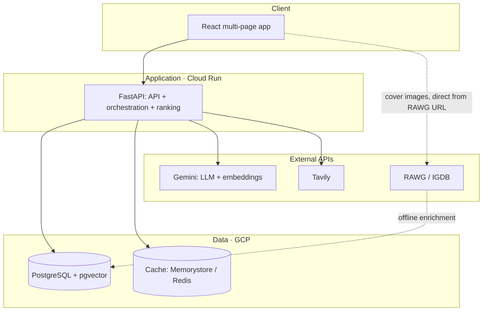
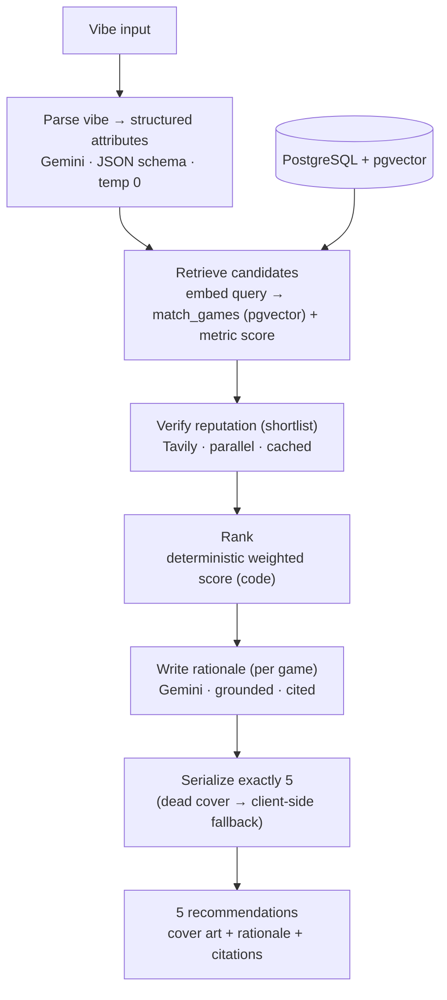
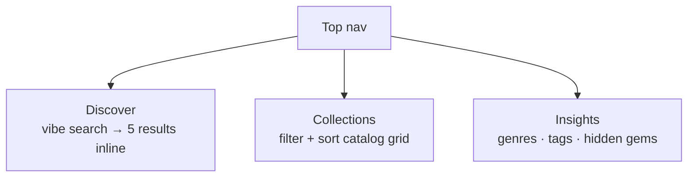
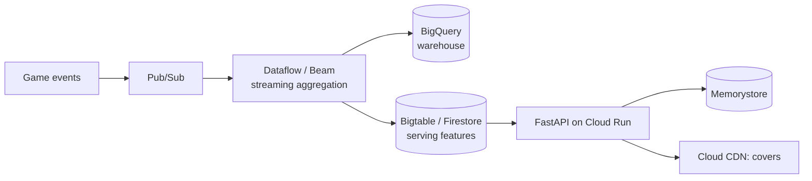

# GPVE — Implementation Plan

**Project:** Xbox Game Pass Vibe Discovery Engine (GPVE)
**Purpose:** The "what/how" build plan — architecture, data specs, pipeline, UI/API, GCP production & scaling, prompts, risks, repo layout. Companion to `DESIGN_RATIONALE.md` (the "why").
**Constraint:** ~2 days — build a working, locally-runnable multi-page MVP satisfying all functional requirements; *document* the production/scale design.

---

> **Status — reconciled.** Written *before* the build (it described an aspirational 7-page app),
> this plan is reconciled to what shipped: a focused **3-page** SPA (Discover · Collections ·
> Insights) satisfying all of REQ-001–009. Divergences are tagged **✅ shipped** / **🔜 deferred**;
> deferred features are catalogued in **§18**, and §9 / §17 are kept as **historical** artifacts.

---

## 1. Objective & scope

Build a backend + polished multi-page UI that cleans the dirty `Gamepass_Games_v1.csv`, takes a
**free-form vibe**, matches it against a **semantically enriched** 2022 catalog, verifies each
candidate's **modern web reputation**, and returns **exactly five** older titles with cover art
and a vibe rationale — surrounded by complementary pages that surface the back catalog.

**Built:** ingestion, enrichment, embeddings, the pipeline, the API, the React UI, local
execution, and (stretch, done) a GCP deploy. **Documented (README deliverables):** the production
architecture, telemetry scaling, prompt-engineering/determinism, and the AI collaboration log.

> **Why it's the crux:** the CSV has **no genre/theme/description fields** — only metrics. The
> product is only possible because we **enrich the catalog at ingestion** and match the vibe
> against that layer. See `DESIGN_RATIONALE.md` §2.

---

## 2. Final system stack

| Layer | System | Role | Sprint → Production |
|---|---|---|---|
| Client | React + Vite + Tailwind + React Router | Multi-page UI (3 pages; shadcn/ui deferred — §18) | Same |
| Application | FastAPI on Cloud Run | API + orchestration + ranking; serves React build | Same |
| Data | PostgreSQL + `pgvector` | Catalog + enrichment + embeddings | Local Docker → Cloud SQL |
| Data | Cache | Web-reputation / result caching (one code path, `REDIS_URL`) | JSON file → Memorystore (Redis) |
| Data | Cover art | Official images | RAWG URL → Cloud Storage + Cloud CDN |
| External | Gemini API | LLM + embeddings | Direct → Vertex AI |
| External | RAWG / IGDB | Enrichment + art | Same |
| External | Tavily | Live web reputation | → Vertex AI grounding |
| Platform | Secret Manager / Cloud Build + Artifact Registry / Cloud Logging + Monitoring | Secrets, CI/CD, observability | Same |

---

## 3. Architecture overview

### 3.1 Layered system



> **Cover art (as-built):** covers are served **straight from the RAWG image URL** stored on each
> row — there is **no Cloud Storage / CDN** in the running system. Re-hosting covers behind Cloud
> Storage + Cloud CDN is a documented production hardening step only (ADR-12, §10, and the
> "Sprint → Production" column in §2).

### 3.2 Request pipeline (vibe → 5 recommendations)



### 3.3 Sitemap (multi-page UI)

**✅ Shipped sitemap (3 pages):**



🔜 **Deferred sitemap nodes** (see §18): a Results route as its own sharable URL, Game detail +
Similar games, curated Collection detail, and a standalone Browse route distinct from Collections.

---

## 4. Data layer

### 4.1 CSV audit (the reality we clean against)

- 455 rows, 9 columns: `GAME`, `RATIO`, `GAMERS`, `COMP %`, `TIME`, `RATING`, `ADDED`, `True_Achievement`, `Game_Score`.
- **No semantic columns.** Enrichment is mandatory (§4.3).
- `TIME` dirty: `100-120 hours`, `1000+ hours`, `0.5-1 hour`; **34 nulls**.
- `GAMERS`: thousands-separator strings (`"84,143"`) and bare values (`777`).
- `RATING`: float 2.0–4.8; **3 nulls**.
- `ADDED`: `06 Jan 22`; **1 null**.
- **2 duplicate titles.**

### 4.2 Cleaning spec (REQ-001)

| Field | Raw form | Cleaning rule | Output |
|---|---|---|---|
| `GAME` | text, edition suffixes | trim; keep raw title; derive `normalized_title` for enrichment matching | `title`, `normalized_title` |
| `RATIO` | string float | cast to numeric | `ratio` |
| `GAMERS` | `"84,143"` / `777` | strip separators → int | `gamers` |
| `COMP %` | float | keep numeric | `completion_pct` |
| `TIME` | range / `+` / singular / null | parse to `(min, max)`; `+` → open upper bound; compute `midpoint`; **null stays null** | `time_min_hours`, `time_max_hours`, `time_midpoint` |
| `RATING` | 2.0–4.8 / null | numeric; **keep nulls** | `rating` |
| `ADDED` | `06 Jan 22` / null | parse to date; keep null | `added_date` |
| `True_Achievement` | int | cast | `true_achievement` |
| `Game_Score` | int | cast | `game_score` |
| (dupes) | 2 duplicates | dedupe (keep first / merge) | — |

**Null policy:** do **not** impute `TIME` or `RATING`. Missing playtime is a real signal (we won't claim a session length we don't know); missing rating lowers that game's metric contribution rather than fabricating a value.

### 4.3 Enrichment spec (the crux)

For each cleaned title, call **RAWG** (IGDB alternative) for: `genres`, `tags`, `themes`, `summary`, `cover_url`, plus `released`/`metacritic` where available.

**Title matching is the main risk** (edition noise — "Special Edition", "Grotesque Ver.", "Legendary Edition"). Pipeline:

1. Normalize: strip edition/version suffixes and punctuation.
2. Query RAWG search with the normalized title.
3. Take the best match; record `rawg_id`.
4. **Log misses** for a quick manual patch.
5. **Cache to local JSON** so a partial failure across ~455 calls doesn't cost the whole run; backoff on rate limits.

**Enriched text** (the embedding input) = `title + genres + tags + themes + summary`. The vibe is matched against this.

### 4.4 Schema (Postgres + `pgvector`)

```sql
create extension if not exists vector;

create table games (
  id                bigserial primary key,
  title             text not null,
  normalized_title  text,
  -- cleaned catalog metrics (CSV)
  ratio             numeric,
  gamers            integer,
  completion_pct    numeric,
  time_min_hours    numeric,
  time_max_hours    numeric,
  time_midpoint     numeric,        -- null = unknown length
  rating            numeric,        -- 2.0–4.8, null allowed
  added_date        date,
  true_achievement  integer,
  game_score        integer,
  -- enrichment (RAWG / IGDB)
  rawg_id           integer,
  genres            text[],
  tags              text[],
  themes            text[],
  summary           text,
  cover_url         text,
  released          date,
  metacritic        integer,
  -- semantic
  enriched_text     text,
  embedding         vector(768),    -- gemini-embedding-001, 768-dim (MRL-truncated)
  -- bookkeeping
  enrichment_status text default 'pending',  -- pending | ok | miss
  updated_at        timestamptz default now()
);

-- Optional at 455 rows (sequential scan is instant); add for scale:
create index on games using hnsw (embedding vector_cosine_ops);
```

**`match_games(query_embedding, match_count=25, exclude_id=null)`**
([sql/02_match_games.sql](../backend/sql/02_match_games.sql)) returns the top-N by cosine
similarity (`1 - (embedding <=> query)`). The optional `exclude_id` lets the same function power
**Similar games** (a game's nearest neighbors, excluding itself).

---

## 5. The recommendation pipeline (stage by stage)

### Stage 1 — Parse the vibe → structured attributes (REQ-003)
**Input:** free-form vibe. **Engine:** Gemini, JSON schema, temperature 0.

> ✅ **Shipped schema** (`VibeIntent`, simpler than the original draft below). The LLM only
> *interprets language* — it never names or scores games.

```json
{
  "search_query": "string (<=15 words: genre + mood, for semantic search)",
  "genres": ["string"],
  "mood_tags": ["string"],
  "session_length": "short | medium | long | any",
  "social": "solo | multiplayer | any"
}
```

### Stage 2 — Retrieve candidates (hybrid)
1. Embed the vibe (`gemini-embedding-001`, 768-dim, `RETRIEVAL_QUERY` task — asymmetric to the
   catalog's `RETRIEVAL_DOCUMENT`).
2. Vector search (cosine) → top ~25 by similarity.
3. Metric re-score → shortlist (~10–15) for the expensive web step.

### Stage 3 — Verify modern reputation (REQ-004, REQ-006 #3)
> ✅ **As-built — deterministic, no LLM.** Per shortlisted game, call **Tavily** (parallel,
> title-keyed cache), then score sentiment with a **fixed lexicon** over the fetched text →
> `{ score ∈ [0,1], summary, citations }`. Same text ⇒ same score. (The original plan used a
> constrained Gemini call here; it was replaced by the lexicon for full determinism.)

### Stage 4 — Rank (deterministic, in code) (REQ-006)
```
final_score = w_vibe   * vibe_similarity
            + w_metrics * metric_score
            + w_web     * reputation_score
```
- `vibe_similarity` — cosine from `match_games`.
- `metric_score` — normalized `rating` + `completion_pct` + log-scaled `gamers` (popularity prior) + **session fit** (`session_length` vs `time_midpoint`; nulls neutral).
- `reputation_score` — Stage 3.
- **Default weights (tunable):** `0.5 / 0.3 / 0.2`. Sort, take top 5.

### Stage 5 — Write rationale (REQ-009)
Per game, grounded Gemini call writes 2–4 sentences using **only** that game's enrichment + cited web summary. No unsupported claims.

### Stage 6 — Validate & serialize (REQ-007, REQ-008)
- Titles come straight from the DB candidates and the model only echoes them, so they're
  inherently in-catalog (no separate existence check needed — see §12).
- Emit exactly **5** in the response schema (§6.2). Dead/missing `cover_url`s fall back to a
  generated tile **client-side** (`CoverImage.tsx`) — not a backend HTTP check.

**Reuse note (🔜 deferred — §18):** these reuses are designed but not yet built. *Curated
Collections* would run this pipeline once per fixed vibe and cache the result; *Similar games*
would skip the pipeline entirely — a pure `match_games` call on a game's own vector (the
`exclude_id` arg already exists in `sql/02_match_games.sql` but is currently unused).

---

## 6. API design

### 6.1 Endpoints

| Method | Path | Purpose | Powers page | Status |
|---|---|---|---|---|
| `POST` | `/api/recommend` | vibe → 5 recommendations | Discover | ✅ shipped |
| `GET` | `/api/games` | filtered/sorted catalog (query params) | Collections | ✅ shipped |
| `GET` | `/api/stats` | catalog aggregates (genres, tags, hidden gems) | Insights / Collections | ✅ shipped (planned as `/api/insights`) |
| `GET` | `/api/health` | liveness/readiness | — | ✅ shipped |
| `GET` | `/*` | serve compiled React app | all | ✅ shipped |
| `GET` | `/api/games/{id}` | full game profile | Game detail | 🔜 deferred (§18) |
| `GET` | `/api/games/{id}/similar` | nearest-neighbor games (`match_games`) | Game detail | 🔜 deferred (§18) |
| `GET` | `/api/collections` | list curated collections | Collections (moods) | 🔜 deferred (§18) |
| `GET` | `/api/collections/{slug}` | a collection's games (cached) | Collection detail | 🔜 deferred (§18) |

**`/api/games` query params (✅ shipped):** `genre`, `search`, `sort` (`rating`\|`popularity`\|`recent`), `limit`. 🔜 The fuller Browse param set originally planned (`tag`, `multiplayer`, `min_rating`, `max_hours`/`min_hours`/`time_bucket`, `page`/`page_size`) is deferred — §18.

### 6.2 `POST /api/recommend` response (✅ shipped contract)
```json
{
  "vibe": "string",
  "intent": { "...": "see Stage 1 VibeIntent schema" },
  "recommendations": [
    {
      "title": "string",
      "cover_url": "string | null",
      "released": "string | null",
      "genres": ["string"],
      "tags": ["string"],
      "rating": 0.0,
      "metacritic": 0,
      "vibe_similarity": 0.0,
      "metric_score": 0.0,
      "web_score": 0.0,
      "final_score": 0.0,
      "rationale": "string | null",
      "sources": [ { "title": "string | null", "url": "string | null" } ]
    }
  ]
}
```
The array contains **exactly 5** items. (The three sub-scores `vibe_similarity` / `metric_score`
/ `web_score` are surfaced directly so the UI can show the deterministic blend, rather than
nesting them under `metrics` / `modern_reputation` as the original draft did.)

### 6.3 Other response shapes (brief)

✅ **Shipped:**
- `GET /api/games` → `{ total, games: [...] }` (each game: `title`, `cover_url`, `genres`, `tags`, `rating`, `gamers`, `time_midpoint`, `released`, `summary`).
- `GET /api/stats` → `{ total, avg_rating, top_genres: [{name,n}], top_tags: [{name,n}], hidden_gems: [{title, rating, gamers, cover_url, genres}] }`.

🔜 **Deferred shapes** (Game detail, Similar, Collections, richer `/api/stats` histograms) are
specced in **§18**; the endpoints are already listed with 🔜 in §6.1.

---

## 7. Frontend & pages

**Multi-page React (React Router); one static bundle served by FastAPI.** Each page is a thin
layer over the catalog/pipeline (see `DESIGN_RATIONALE.md` ADR-5). Sitemap in §3.3. **Three pages
shipped** (nav: **Discover · Collections · Insights**); the rest are deferred to §18.

### 7.1 ✅ Shipped pages

**Discover** (`/`) — the centerpiece, and it now also renders the results **inline** (the planned
separate Results page was folded in). Prominent free-form vibe field (REQ-002) with example-vibe
chips that submit on click. On submit it shows a loading spinner, then the parsed-intent chips
(mood tags · session length · social), followed by the **five** recommendation cards (REQ-007).
Each card (`ResultCard`): cover art (REQ-008), title + release year + rating, genre/tag chips, the
per-game **vibe rationale** (REQ-009), three score bars (vibe / metrics / web — the deterministic
sub-scores), and web-reputation **source links**.

**Collections** (`/collections`) — a **filterable, sortable catalog browser** over the enriched
catalog (this is effectively the planned *Browse* page; the curated-mood concept that originally
owned this name is deferred — §18). Controls: genre chips (from `/api/stats`), a debounced title
search, and a sort dropdown (top-rated / most-played / newest). Renders a responsive `GameCard`
grid from `/api/games`.

**Insights** (`/insights`) — a data-viz dashboard over the cleaned catalog from `/api/stats`:
a **top-genres** bar chart (hand-rolled CSS bars), a **common-tags** weighted cloud, and a
**hidden-gems** strip (highly rated, lightly played — the back-catalog worth reigniting).

**Components (shipped):** `Layout` (sticky nav + footer), `GameCard`, `CoverImage` (lazy art with
fallback), `Spinner`. Metric chips and the filter bar are inlined into their pages rather than
extracted. Styling is **Tailwind only** (no shadcn/ui).

**Polish (shipped):** loading spinners (the web step is slow), empty/error states, responsive grid
layout, consistent spacing/typography via Tailwind.

### 7.2 🔜 Deferred pages & UI (§18)

Originally specified here but **not yet built**: a sharable **Results** route (`/results?vibe=…`),
**Game detail** (`/game/:id`) + **Similar games**, a standalone **Browse** route distinct from
Collections, **curated mood Collections** + **Collection detail**, richer **Insights** charts
(completion-vs-rating scatter, playtime histogram, a chart library), and Discover extras
(**Surprise me**, **refinement chips**).

---

## 8. Requirements traceability

| Req | Requirement | Covered by | Status |
|---|---|---|---|
| REQ-001 | Parse + sanitize CSV; handle dirty data | §4.2 | Built |
| REQ-002 | Prominent free-form vibe input | Discover (§7) | Built |
| REQ-003 | Parse vibe → candidate matches | Stage 1 + 2 | Built |
| REQ-004 | Live web search for deeper context | Stage 3 (Tavily) | Built |
| REQ-005 | Dynamic cover-art URL resolution | §4.3 (RAWG) | Built |
| REQ-006 | Synthesize 3 inputs into ranking | Stage 4 | Built |
| REQ-007 | Display exactly 5 titles | Stage 6 + Results | Built |
| REQ-008 | Render cover art per game | Cards / detail (§7) | Built |
| REQ-009 | Per-game vibe rationale block | Stage 5 + Results | Built |
| Additive | Catalog browser (Collections route) + Insights dashboard | §7.1 | Built |
| Additive | Game detail, Similar games, curated Collections, standalone Browse | §18 | Deferred |
| README | System architecture / scaling | §10, §11 | Documented |
| README | Prompt-engineering / determinism | §12 | Documented |
| README | AI collaboration log | §13 | Documented |

---

## 9. The 2-day execution plan *(historical)*

> The original pre-build schedule, kept for context. Actual shipped scope is in §7.1; deferred
> items in §18. It listed Game detail + Similar as "protect" — later descoped to finish the 3
> core pages plus the full README/infra docs (and the stretch deploy) instead.

- **Day 1 — data + brains.** Skeleton + `docker-compose` (Postgres/pgvector); CSV cleaning
  (§4.2); RAWG enrichment (§4.3, cached, miss log); embeddings; schema + `match_games`; load.
  Then FastAPI `/api/recommend` (the pipeline, client abstraction, cache, deterministic ranking,
  grounded rationale) + cheap read endpoints; freeze schemas; test with `curl` before any UI.
- **Day 2 — frontend + docs.** Vite + Tailwind + React Router; the pages + loading/empty/error
  states; fold the React build into FastAPI (single container); write the README. **Stretch
  (done):** Dockerfile, GCP deploy, Memorystore cache.

**Prioritized cut:** protect the data pipeline + `/recommend` + core pages + README;
comprehensiveness adds Collections + Insights; drop deploy / Redis / Browse / auth first if behind.

---

## 10. GCP production architecture

> **Built & deployed** via Terraform ([infra/](../infra/)) — ✅ = live, 🔜 = documented-only.
> Secrets are 4 Secret Manager entries incl. an assembled `DATABASE_URL`; the data tier sits
> behind a private VPC + Serverless VPC connector.

- ✅ **Cloud Run** runs one container (FastAPI API + React static); a Cloud Run **Job** seeds the catalog.
- ✅ **Cloud SQL (PostgreSQL + `pgvector`)** holds catalog + enrichment + embeddings; private IP via Serverless VPC Access connector.
- ✅ **Memorystore (Redis)** for caching (web summaries, full results); toggled by `REDIS_URL`.
- 🔜 **Cloud Storage + Cloud CDN** for re-hosted cover art.
- 🔜 **Vertex AI** for LLM + embeddings + grounding (production swap for Gemini-direct and Tavily).
- ✅ **Secret Manager** for all keys/creds (referenced by Cloud Run, never baked into images).
- ✅ **Cloud Build → Artifact Registry → Cloud Run** CI/CD from GitHub (2nd-gen connection); **Terraform** for IaC.
- 🔜 **Cloud Logging / Monitoring / Trace** dashboards for latency, cache-hit rate, token spend, fallback rate.
- 🔜 **Cloud Run Jobs + Cloud Scheduler** to re-run enrichment/embeds on catalog updates (the seed Job exists; the schedule doesn't).

**Connection notes.** Local dev: local Docker Postgres (or Cloud SQL Auth Proxy) — code reads `DATABASE_URL`. Cloud Run: native Cloud SQL connector / private IP. The only difference between dev and prod is configuration, not code.

---

## 11. Scaling: flat CSV → live telemetry (README deliverable)

> ⚠️ **Proposed production design — not the as-built system.** This is the brief's *written
> scaling proposal*. **None of the components below are deployed today except Memorystore**,
> which the MVP already uses as its reputation/result cache. Pub/Sub, Dataflow, BigQuery,
> Bigtable/Firestore, Cloud CDN, and Vertex AI Vector Search are all forward-looking — the point
> is that the current ingestion/serving split makes this evolution mostly additive (see §10 for
> what *is* built and deployed).



**Split signals by how fast they change:** static-ish signals (genres, themes, tags) refresh on a batch schedule; dynamic signals (popularity, recent completion, trending, sentiment) update continuously from telemetry.

**State management:** the request path reads **precomputed features** from a low-latency serving store (Bigtable for high-QPS key lookups, or Firestore); the vector index receives streaming/batch upserts (pgvector at moderate scale → Vertex AI Vector Search at very large scale).

**Caching:** Memorystore fronts hot queries, per-game sentiment, and collection results; Cloud CDN fronts images; full recommendations are cached by a **normalized (vibe, segment)** key.

**Why it holds:** decoupling the slow/expensive work (enrichment, embeddings, web sentiment) from the fast serving path lets the same architecture survive the jump from 455 rows to millions of events/day.

---

## 12. Prompt-engineering & determinism design (README deliverable)

> ✅ **As-built — see the README's "Prompt Engineering & Determinism" deliverable for the
> verbatim prompts and the full mechanism table.** This is the design intent it grew from.

**Principles**
- **Structured outputs** (JSON schema) for vibe parsing and rationale; **temperature 0**, thinking disabled.
- **Constrained generation:** the model only sees the candidate games passed to it — it cannot introduce a game outside the catalog.
- **Ranking lives in code,** not the model (`DESIGN_RATIONALE.md` ADR-9).
- **Reputation is a deterministic lexicon** (not an LLM call) — same fetched text ⇒ same score.
- **Grounding:** rationale claims must be supported by the provided enrichment fields + fetched web text.

---

## 13. AI collaboration log (README deliverable)

> ✅ **The real, as-built collaboration log lives in the README** ("Deliverable: AI Collaboration
> Log"). This was a planning template; the README supersedes it.

---

## 14. Risks & mitigations

| Risk | Impact | Mitigation |
|---|---|---|
| **RAWG title matching** (edition suffixes) | Wrong/missing enrichment; can eat a morning | Normalize titles, search + best-match, log misses, cache to JSON, backoff |
| External API reliability / rate limits / ToS | Failures, broken images | Cache aggressively; graceful fallback; re-host covers in prod |
| Web step latency/cost | Slow responses | Small shortlist, parallel calls, cache (TTL), Memorystore in prod |
| Scope creep from extra pages | Timeline slip | Prioritized cut (§9); each page is a thin layer over existing backend |
| "Vibe match" is subjective | Hard to evaluate | Golden-query set + human rating; tune weights |
| Determinism vs LLM variance | Inconsistent ranking | Ranking in code; temp 0; grounded, validated outputs |
| Data freshness (2022 lock) | Games no longer on Game Pass | Correct for the exercise; flag live-catalog reconciliation for production |
| Cold starts (Cloud Run) | First-request latency | Min-instances if needed; warm critical paths |

---

## 15. README deliverable checklist *(complete)*

> All items shipped in the top-level [README.md](../README.md): what-it-is + run instructions,
> architecture + pipeline diagrams, the scaling / determinism / AI-collaboration deliverables,
> the CSV cleaning approach, and known limitations (data freshness).

---

## 16. Suggested repository structure

> ✅ **Actual shipped tree** (reconciled). Differences from the original draft: routers are
> consolidated (`catalog.py` + `recommend.py`); the LLM client is `gemini.py` (+ `tavily.py`);
> the pipeline has `metric.py` + `reputation.py` + a `recommend.py` orchestrator; Dockerfile +
> `cloudbuild.yaml` live at the repo root; SQL files are numbered; `seed.py` was added; frontend
> is 3 pages. 🔜 Files for deferred features (Game detail, curated Collections, charts,
> `build_collections.py`) are not present — see §18.

```
gpve/
├── README.md
├── Dockerfile                      # multi-stage (frontend build + backend), Cloud Run-ready
├── docker-compose.yml              # local Postgres + pgvector
├── cloudbuild.yaml                 # CI → Artifact Registry → Cloud Run
├── docs/
│   ├── DESIGN_RATIONALE.md
│   └── IMPLEMENTATION_PLAN.md
├── data/
│   ├── Gamepass_Games_v1.csv
│   ├── enrichment_cache.json       # tracked (reproducible offline runs)
│   ├── embeddings_cache.json       # tracked
│   └── web_reputation_cache.json   # tracked
├── backend/
│   ├── app/
│   │   ├── main.py                 # FastAPI app + lifespan + static serving
│   │   ├── config.py               # env vars (DATABASE_URL, keys, weights)
│   │   ├── routers/
│   │   │   ├── recommend.py        # POST /api/recommend
│   │   │   └── catalog.py          # GET /api/health, /api/stats, /api/games
│   │   ├── pipeline/
│   │   │   ├── parse.py            # Stage 1 — vibe → VibeIntent
│   │   │   ├── retrieve.py         # Stage 2 — embed + vector search
│   │   │   ├── metric.py           # Stage 3 — deterministic metric re-score
│   │   │   ├── reputation.py       # Stage 4 — Tavily web reputation (+ cache)
│   │   │   ├── rank.py             # Stage 5 — weighted blend (0.5/0.3/0.2)
│   │   │   ├── rationale.py        # Stage 6 — grounded per-game rationale
│   │   │   └── recommend.py        # orchestrator tying the stages together
│   │   └── clients/
│   │       ├── gemini.py           # Gemini LLM + embeddings (retry/backoff)
│   │       ├── tavily.py           # web search (fails soft → [])
│   │       ├── db.py               # asyncpg pool + pgvector codec
│   │       └── cache.py            # File ⇄ Redis reputation cache (by REDIS_URL)
│   ├── ingest/
│   │   ├── clean.py                # CSV cleaning
│   │   ├── enrich.py               # RAWG enrichment + title matching
│   │   ├── embed.py                # embeddings
│   │   ├── load.py                 # rebuild games table
│   │   └── seed.py                 # apply sql/*.sql then load (Cloud Run Job)
│   ├── sql/
│   │   ├── 01_schema.sql
│   │   └── 02_match_games.sql      # supports exclude_id (for deferred Similar games)
│   ├── tests/                      # pytest suite (+ conftest.py)
│   ├── requirements.txt
│   └── .env.example
├── frontend/
│   ├── src/
│   │   ├── main.tsx
│   │   ├── App.tsx                 # router
│   │   ├── index.css               # Tailwind layers + theme tokens
│   │   ├── lib/
│   │   │   └── api.ts              # typed backend client
│   │   ├── pages/
│   │   │   ├── Discover.tsx        # vibe search + inline results
│   │   │   ├── Collections.tsx     # filter/sort catalog browser
│   │   │   └── Insights.tsx        # stats dashboard
│   │   └── components/
│   │       ├── Layout.tsx
│   │       ├── GameCard.tsx
│   │       ├── CoverImage.tsx
│   │       └── Spinner.tsx
│   ├── package.json
│   ├── tailwind.config.js
│   ├── postcss.config.js
│   ├── tsconfig.json
│   └── vite.config.ts
└── infra/
    └── *.tf                        # Terraform (full GCP deploy; optional)
```

---

## 17. Immediate next steps *(historical — all complete)*

> The original from-scratch build order: Postgres/pgvector → `clean` → `enrich` → `embed` +
> `load` → pipeline behind `/api/recommend` + read endpoints → multi-page UI → README →
> containerize + deploy. Foundation first (ingestion + enrichment + schema); everything else sat
> on it. Forward-looking work is in §18.

---

## 18. Roadmap — deferred features (future work)

The 3-page MVP (§7.1) satisfies all functional requirements; these were specified in the original
plan but cut to protect the core. Ordered by value-for-effort; most backend foundations already
exist, so they're largely additive.

1. **Game detail + Similar games** *(highest value, lowest effort)* — `GET /api/games/{id}` +
   `/similar` (wire the existing `match_games(…, exclude_id)`, already supported but unused), and
   a `/game/:id` page with the full metric set + a SimilarGames strip. Similar is pure vector
   search (no LLM) → instant and free.
2. **Sharable Results route** — promote Discover's inline results to `/results?vibe=…` so a set is bookmarkable.
3. **Curated Collections + detail** — `ingest/build_collections.py` runs the pipeline once per
   fixed mood vibe and caches it; `GET /api/collections[/{slug}]` serve from cache; rename the
   current catalog browser to **Browse**.
4. **Standalone Browse + richer filters** — split the catalog grid into `/browse`; extend
   `/api/games` with `tag`, `multiplayer`, `min_rating`, `max_hours`, pagination.
5. **Discover UX extras** — "Surprise me" and post-result refinement chips ("shorter", "more co-op").
6. **Richer Insights charts** — completion-vs-rating scatter, histograms, "grindiest games"; needs richer `/api/stats` aggregates.
7. **Design-system polish** — adopt shadcn/ui (or keep hand-rolled Tailwind), with an animation refresh.
